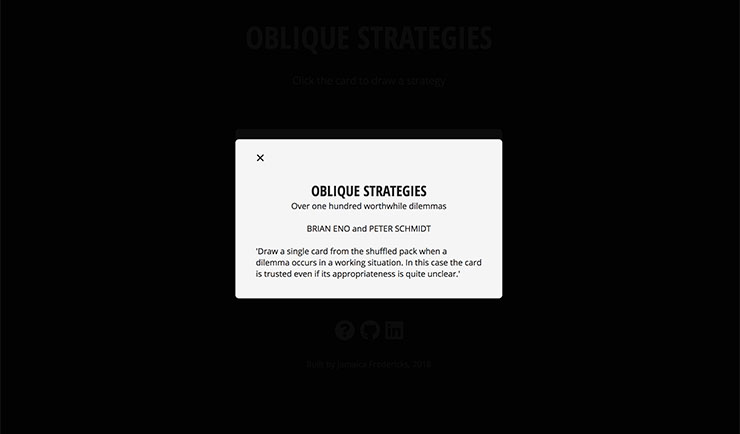

# Oblique Strategies

_Oblique Strategies_ is a creativity tool designed by [Brian Eno](https://en.wikipedia.org/wiki/Brian_Eno) and [Peter Schmidt](<https://en.wikipedia.org/wiki/Peter_Schmidt_%28artist%29). It originally took the form of a deck of cards, where each card offers a suggestion towards overcoming a creative block. Meditative, cryptic, and occasionally bombastic, each card's message is
open to interpretation.

[Oblique Strategies live site](http://www.jamaicafredericks.com/obliqueStrategies/)

 

 

The app is written in Vanilla JavaScript, using CSS, HTML5, and Webpack. **

Eno and Schmidt's writings are stored in `data.js`, and selected at random.

 

 

** When I started learning to code, one of the first programs I wrote was a command line version of _Oblique Strategies_.  
(I wrote it in Ruby, and yes, it did contain obscenely long methods, `$stdin.gets.chomp`, and `puts` many empty strings :D)
This is a DRYer, prettier version.

 

[more info about Oblique Strategies](https://en.wikipedia.org/wiki/Oblique_Strategies)

[listen to some of Brian Eno's music](https://www.youtube.com/watch?v=pn1riJSHhkY)
